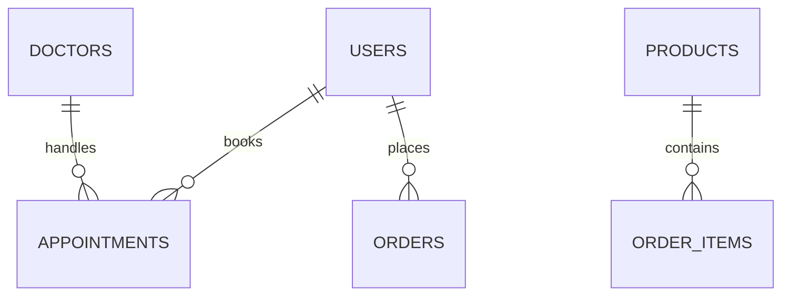

# 🏥 QickMed - Hệ Thống Quản Lý Phòng Khám

<div align="center">


[](https://www.php.net/)
[](https://www.mysql.com/)
[](LICENSE)

_Giải pháp quản lý phòng khám toàn diện, hiện đại và thông minh_

[Demo](https://demo.qickmed.com) • [Tài Liệu](https://docs.qickmed.com) • [Báo Lỗi](https://github.com/qickmed/issues)

</div>

---

## 📋 Mục Lục

- [🌟 Tổng Quan](#-tổng-quan)
- [💻 Công Nghệ Sử Dụng](#-công-nghệ-sử-dụng)
- [✨ Tính Năng Chính](#-tính-năng-chính)
- [⚙️ Cài Đặt](#️-cài-đặt)
- [📁 Cấu Trúc Hệ Thống](#-cấu-trúc-hệ-thống)
- [🔌 API Endpoints](#-api-endpoints)
- [🧮 Tính Toán và Xử Lý](#-tính-toán-và-xử-lý)
- [🔒 Bảo Mật](#-bảo-mật)
- [🚀 Deployment](#-deployment)
- [❓ Troubleshooting](#-troubleshooting)

## 🌟 Tổng Quan

QickMed là hệ thống quản lý phòng khám toàn diện, tích hợp nhiều tính năng hiện đại:

| Mô-đun                | Mô tả                                |
| --------------------- | ------------------------------------ |
| 👨‍⚕️ Quản lý Lịch hẹn   | Đặt lịch online, quản lý lịch bác sĩ |
| 👥 Quản lý Người dùng | Hồ sơ bệnh nhân, bác sĩ, nhân viên   |
| 💊 Bán Thuốc          | E-commerce, quản lý kho, đơn hàng    |
| 🤖 Chatbot AI         | Tư vấn 24/7, phân tích triệu chứng   |
| 📊 Báo cáo            | Thống kê, phân tích dữ liệu          |
| 📱 Mobile             | Responsive design, PWA support       |

## 💻 Công Nghệ Sử Dụng

### 🎨 Frontend

```json
{
  "CSS & UI": [
    "Bootstrap 5.3.0",
    "Font Awesome 6.4.0",
    "Select2 4.1.0",
    "Flatpickr",
    "SweetAlert2"
  ],
  "JavaScript": [
    "jQuery 3.6.0",
    "Bootstrap Bundle JS",
    "Select2 JS",
    "Flatpickr JS",
    "AOS (Animate On Scroll)"
  ]
}
```

### ⚡ Backend

```json
{
  "Core": ["PHP 8.0+", "MySQL 8.0+", "Apache/Nginx"],
  "APIs": ["RESTful Architecture", "JSON Web Tokens", "OpenAPI Specification"]
}
```

### 🔗 Tích Hợp

- 🗺️ Vietnam Provinces API
- 🤖 OpenAI API
- 💳 Payment Gateways

## ✨ Tính Năng Chính

### 📅 Quản Lý Lịch Hẹn

- ⏰ Đặt lịch trực tuyến
- 📊 Quản lý lịch bác sĩ
- 📱 Nhắc nhở qua SMS/Email
- 📈 Theo dõi trạng thái

### 👥 Quản Lý Người Dùng

- 👨‍⚕️ Phân quyền: Admin, Bác sĩ, Bệnh nhân
- 📋 Hồ sơ chi tiết
- 📜 Lịch sử khám bệnh
- 💊 Quản lý đơn thuốc

### 🛒 Bán Thuốc Trực Tuyến

- 📦 Danh mục sản phẩm
- 🛍️ Giỏ hàng thông minh
- 💰 Tính giá tự động
- 📦 Quản lý tồn kho

### 🤖 Chatbot Tư Vấn

- 💬 Tư vấn 24/7
- 🔍 Phân tích triệu chứng
- 👨‍⚕️ Kết nối bác sĩ
- 📝 Lưu lịch sử chat

## ⚙️ Cài Đặt

### 📋 Yêu Cầu

```bash
# Hệ thống
PHP >= 8.0
MySQL >= 8.0
Apache/Nginx
Composer
Node.js & npm (optional)
```

### 🚀 Các Bước Cài Đặt

1️⃣ **Clone Repository**

```bash

```

2️⃣ **Cài Đặt Database**

```bash
# Cách 1: Import SQL
mysql -u root -p qickmed < database/setup_database.sql

# Cách 2: Setup tự động
http://localhost/qickmed/setup.php
```

3️⃣ **Cấu Hình**

```bash
# Copy file env
cp .env.example .env

# Cập nhật thông tin
nano .env
```

4️⃣ **Khởi Tạo**

```bash
composer install
npm install
npm run build
```

## 📁 Cấu Trúc Hệ Thống

### 📂 Thư Mục

```
qickmed/
├── 📁 admin/          # Quản trị hệ thống
├── 📁 api/            # REST API endpoints
├── 📁 assets/         # CSS, JS, images
├── 📁 includes/       # PHP includes
├── 📁 database/       # SQL files
├── 📁 uploads/        # User uploads
└── 📁 vendor/         # Dependencies
```

### 🗃️ Database Schema



## 🔌 API Endpoints

### 📅 Appointment APIs

```http
GET    /api/appointments     # Lấy danh sách lịch hẹn
POST   /api/appointments     # Tạo lịch hẹn mới
PUT    /api/appointments/:id # Cập nhật lịch hẹn
DELETE /api/appointments/:id # Hủy lịch hẹn
```

### 👤 User APIs

```http
POST /api/auth/login        # Đăng nhập
POST /api/auth/register     # Đăng ký
GET  /api/user/profile     # Thông tin user
PUT  /api/user/profile     # Cập nhật profile
```

### 🛒 Product APIs

```http
GET  /api/products         # Danh sách sản phẩm
GET  /api/products/:id     # Chi tiết sản phẩm
POST /api/cart            # Thêm vào giỏ hàng
GET  /api/orders          # Lịch sử đơn hàng
```

## 🧮 Tính Toán và Xử Lý

### 💰 Tính Giá và Giảm Giá

```php
function calculateDiscountPrice($price, $rating) {
    // Tính giảm giá dựa trên rating
    $discount = ($rating >= 4.5) ? 0.1 : 0;
    return $price * (1 - $discount);
}
```

### 🧾 Tính Tổng Đơn Hàng

```php
function calculateOrderTotal($items, $shipping = 0) {
    $subtotal = array_sum(array_map(
        fn($item) => $item['price'] * $item['quantity'],
        $items
    ));
    return $subtotal + $shipping;
}
```

### 📊 Format Dữ Liệu

```php
// Format tiền tệ VND
function formatCurrency($amount) {
    return number_format($amount, 0, ',', '.') . '₫';
}

// Format ngày tháng
function formatDate($date) {
    return date('d/m/Y H:i', strtotime($date));
}
```

## 🔒 Bảo Mật

### 🛡️ Các Biện Pháp

- 🔑 Password hashing (bcrypt)
- 🚫 CSRF protection
- 🛡️ SQL injection prevention
- 🔒 XSS protection
- ⚡ Rate limiting
- 📝 Session management

### ✅ Best Practices

1. Regular updates
2. Secure file permissions
3. SSL/HTTPS
4. Input validation
5. Error logging

## 🚀 Deployment

### 🌐 Production Setup

1. Server configuration
2. SSL certificate
3. Database optimization
4. Cache configuration
5. Error handling

### 📊 Monitoring

- 📝 Error logging
- 📈 Performance tracking
- 📊 User analytics
- 🔍 System health checks

## ❓ Troubleshooting

### ⚠️ Common Issues

1. Database connection errors
2. File permission issues
3. Email sending problems
4. Session management
5. Cache clearing

### 🔧 Debug Tools

- 📝 Error logs
- 🔍 Debug console
- 🧪 Testing tools
- 📊 Performance profiler

---

## 📞 Liên Hệ & Hỗ Trợ

<div align="center">

[](mailto:support@qickmed.com)
[](https://qickmed.com)
[](https://github.com/qickmed)

</div>

## 📄 License

<div align="center">

Copyright © 2025 QickMed. All rights reserved.

</div>

---

<div align="center">

**Version**: 2.0.0  
**Last Updated**: 2025  
**Author**: Dalziel

</div>
